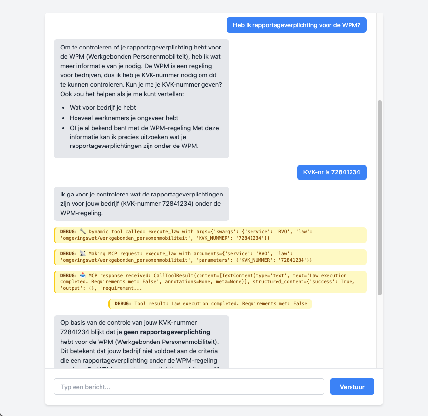

# MCP Chatbot Demonstration

This service demonstrates how Model Context Protocol (MCP) can be used as a tool execution layer in Large Language Model (LLM) applications. It showcases a Dutch government services chatbot that uses MCP to dynamically access and execute legal and administrative tools.



## What is MCP?

Model Context Protocol (MCP) allows LLMs to securely access external tools and data sources during conversations. This demo shows how MCP enables an AI assistant to:

- Dynamically discover available tools from an MCP endpoint
- Execute Dutch government law calculations (benefits, subsidies, pensions)
- Check eligibility for various services
- Provide accurate, real-time information by calling external APIs

## Architecture

- **Backend** (`main.py`): FastAPI application with WebSocket support
  - Uses LangChain with Claude (Anthropic) as the LLM
  - Integrates with MCP endpoint to discover and execute tools dynamically
  - Implements LangGraph for conversation flow management
  - Provides real-time streaming responses via WebSocket

- **Frontend** (`index.html`): Clean web interface
  - Real-time chat interface with markdown support
  - Debug messages showing MCP tool executions
  - Quick reply suggestions for common interactions

## Key Features

- **Dynamic Tool Discovery**: Tools are loaded from MCP endpoint at startup
- **Real-time Streaming**: Responses stream word-by-word for better UX
- **Debug Transparency**: Shows when and how MCP tools are called
- **Dutch Government Focus**: Specialized for Nederlandse uitkeringen, toeslagen, and overheidsregelingen

## Usage

1. **Start the backend server**:
   ```bash
   ANTHROPIC_API_KEY=... uv run main.py
   ```

2. **Open the frontend**:
   Open `index.html` in your web browser

3. **Chat with the assistant**:
   - Ask questions about Dutch benefits and subsidies
   - Watch debug messages show MCP tool executions
   - Try queries like:
     - "Kan ik huurtoeslag krijgen?"
     - "Hoeveel AOW krijg ik?"
     - "Ben ik eligible voor zorgtoeslag?"

## Prerequisites

- Python with `uv` package manager
- Required dependencies (installed via `uv run`)
- Anthropic API key (Claude model access)
- Internet connection (for MCP endpoint and CDN resources)

## MCP Integration

The service connects to an MCP endpoint that provides tools for:
- `execute_law`: Execute specific Dutch laws with given parameters
- `check_eligibility`: Verify eligibility for government services
- Support for various services (TOESLAGEN, SVB, RVO) and laws

This demonstrates how MCP can make AI assistants more capable by providing secure, controlled access to external tools and data sources.
